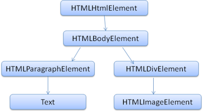

无论是渗透测试工程师还是程序员都必须的了解下 __浏览器渲染过程__ 这是必要的，否则程序员写出来的网页可能在浏览器渲染的很慢,就是因为没有了解 __浏览器渲染过程__ 渗透测试工程师也是需要了解的

# 浏览器渲染原理
> 在你在浏览器地址栏输入URL时，浏览器就已经进入开始渲染模式了，浏览器会根据你浏览历史来匹配你最有可能输入的url呈现在url地址栏，当你按下回车键的时候浏览器获取url资源，进行渲染，大致过程是这样的：(解析HTML并构建DOM树 --> 渲染树构建 --> 渲染树布局 --> 绘制渲染树)，在渲染过程中浏览器会调用HTML解析器、CSS解析器、JS解析器

## 解析HTML构建DOM树:

    浏览器在获取到URL资源(HTML)，浏览器会解析HTML构建DOM树，浏览器会根据HTML的标签、关系进行都建DOM树，在DOM树中，每一个HTML标签都有一个对应的节点，并且每一个文本也都会有一个对应的文本节点。其中HTML解析器会参与解析

如代码:
```
<html>
	<body>
		<p>
			Hello World
		</p>
		<div> </div>
	</body>
</html>
```
浏览器会解析HTML构建相应的DOM树：


这样DOM就构建好了

## 渲染树构建：

>DOM树构建好了下一步就是渲染树构建了，DOM和渲染树有点相似，但是还是有区别的，DOM树每个节点都是HTML标签但是，但在渲染树中标签应用了display:none、<head></head>、等不可见的元素是不存在与渲染树中的，也就是说渲染树只包含可见的HTML元素

渲染树的构建按照渲染引擎来具体操作,渲染引擎有：
>Gecko --Firefox使用的就是Gecko

>Webkit --Safari 和 Chrome 都使用 Webkit

这两大类，其他的自行百度吧

## 渲染树布局：

渲染树布局是按照CSS代码定义来布局的、用来确定每个节点在屏幕上的确切显示位置，元素的位置、颜色、大小、样式等等，这是完全可以由用户控制的。其中CSS解析器会参与解析

## 绘制渲染树：

遍历渲染树并用UI后端层将每一个节点绘制出来，然后呈现在用户面前

## 解析器：
在浏览器渲染过程中解析器也会被调用
例如在解析HTML是浏览器会调用HTML解析器、在解析JS会调用JS解析器。
说到解析器不得不说下 __语法分析__ 和 __词法分析__
__语法分析__

>解析是以文档所遵循的语法规则（编写文档所用的语言或格式）为基础的。所有可以解析的格式都必须对应确定的语法（由词汇和语法规则构成）。这称为与上下文无关的语法。人类语言并不属于这样的语言，因此无法用常规的解析技术进行解析。
简单点说就是语法分析是应用语言的语法规则的过程

__词法分析__

>词法分析是将输入内容分割成大量标记的过程。标记是语言中的词汇，即构成内容的单位。在人类语言中，它相当于语言字典中的单词。

解析器通常将解析工作分给以下两个组件来处理：词法分析器（有时也称为标记生成器），负责将输入内容分解成一个个有效标记；而解析器负责根据语言的语法规则分析文档的结构，从而构建解析树。词法分析器知道如何将无关的字符（比如空格和换行符）分离出来。

### HTML解析器:
在解析HTML文档时，浏览器会调用HTML解析器来解析HTML。
只有符合HTML解析器的规则才能被HTML解析器解析
在HTML元素中可分为5类：

>空元素 如<area>,<br>,<base>等等
>原始文本元素 有<script>和<style>
>RCDATA元素 有<textarea>和<title>
>外部元素 例如MathML命名空间或者SVG命名空间的元素
>基本元素 即除了以上4种元素以外的元素

这5类的区别是：
>空元素，不能容纳任何内容（因为它们没有闭合标签，没有内容能够放在开始标签和闭合标签中间）。
>原始文本元素，可以容纳文本。
>RCDATA元素，可以容纳文本和字符引用。
>外部元素，可以容纳文本、字符引用、CDATA段、其他元素和注释
>基本元素，可以容纳文本、字符引用、其他元素和注释

一个HTML解析器作为一个状态机，它从输入流中获取字符并按照转换规则转换到另一种状态。在解析过程中，任何时候它只要遇到一个'<'符号（后面没有跟'/'符号）就会进入“标签开始状态(Tag open state)”。然后转变到“标签名状态(Tag name state)”，“前属性名状态(before attribute name state)”......最后进入“数据状态(Data state)”并释放当前标签的token。当解析器处于“数据状态(Data state)”时，它会继续解析，每当发现一个完整的标签，就会释放出一个token

__字符实体__ ：
为了将代码和数据区分开来，在HTML中使用了字符实体来避免代码和数据相互混淆，这就是为什么防御XSS是要转移特殊字符了，如果没有字符实体的话用户输入的数据很有可能会被当成HTML代码来执行造成XSS
字符实体命名规则是：& + 预定义的实体的名称 + ; 例如 __<__ 的字符实体就是 &lt;
字符实体还有另一种表示方式，就是 &# + 预定义的实体的数值 + ; 这样的称为实体编号

在原始文本元素中字符实体是不会被解析的，而在RCDATA元素、外部元素、基本元素中字符实体会被解析
### URL解析器
URL资源类型必须是ASCII字母（U+0041-U+005A || U+0061-U+007A），不然就会进入“无类型”状态。例如，你不能对协议类型进行任何的编码操作，不然URL解析器会认为它无类型。还有协议当中的:冒号也是不能被编码的。
URL编码过程使用UTF-8编码类型来编码每一个字符。如果你尝试着将URL链接做了其他编码类型的编码，URL解析器就可能不会正确识别。

当然可以利用HTML解析器来进行编码,可以将协议及 : 冒号用HTML字符实体来代替，当HTML被解析的时候就可以还原协议


### JS解析器

当HTML文件包含JS代码时，浏览器会调用JS解析器来解析JS代码。
JS解析器首先会进行预解析，寻找var、function、参数，首先会给变量赋予初值underfind(未定义)，当函数名与变量名重复时会保留函数、当定义多个同名函数时会保留最后一个。
Example:
```
<script type="text/javascript">
alert(a);
var a = 1;
function a(){
  alert(2);
}
alert(a);
</script>
```
流程：浏览器调用JS解析器解析，进行预解析找到a变量并赋予初值underfind，然后继续解析找到a函数，根据同名变量和函数，保留函数，此时a是函数块，预解析完成正式执行代码，执行alert(a)时弹出的是代码块
```
function a(){
  alert(2);
}
```
然后表达式a=1覆盖了a的值（现在为1），遇到a函数不解析，执行到alert(a)将弹出1.

JS解析器不能解析HTML字符实体，但是可以解析JS十六进制编码和JS8进制编码，JS16进制由 \x开头 8进制由 \0 开头，还有JSUnicode编码

在JS中十六进制和八进制只能被识别为字符串。而JSUnicode编码的可以在JS充当标识符和字符串。
>总的来说，Unicode转义序列只有在标识符名称里不被当作字符串，也只有在标识符名称里的编码字符能够被正常的解析。

Example:
```
<script type="text/javascript">
alert('\x31'); //编码数字1 充当字符串 可被解析
alert(\x31); //编码数字1 充当字符串 由于没在引号里面 所以不会执行
\x61\x6c\x65\x72\x74(1); //编码alert 由于只能充当字符串所以出现在标识符中不会被解析 不执行
alert('\u0032'); //JSUnicode编码数字2 可以被解析执行
alert(\u0032); //JSUnicode 只能充当字符串和标识符，不会执行
\u0061\u006c\u0065\u0072\u0074(2); //JSUnicode编码alert 充当标识符 可以执行弹窗
```
无论是JSUnicode还是JS十六进制、八进制都不可以充当控制字符，所以不可以编码();等等

JS编码还有aaencode、jjencode 可以充当JS代码已达到代码混淆。详情百度。


### 解析流：

首先是HTML解析器上场，随后根据代码来确定调用URL解析器、JS解析器（也可以只有HTML解析器工作）、当遇到 __&#60;a&#62;__ 中的 __href__ 属性时会调用URL解析器 还有IMG的SRC属性等等、当遇到__&#60;script&#62;__ 标签时会调用JS解析器 还有标签的事件中。

Example:
```
<a href="http://www.ixsrc.cn" onclick="alert('Going')">IXSRC.CN</a>
```
调用解析器的过程：HTML解析器 --> URL解析器 --> JS解析器

Example:
```
<a href=# onclick="alert('Going')">IXSRC.CN</a>
```
调用解析器的过程：HTML解析器 --> JS解析器

Example:
```
<a href=# onclick="window.open("http://www.ixsrc.cn")">IXSRC.CN</a>
```
调用解析器的过程：HTML解析器 --> JS解析器 --> URL解析器

具体情况还要具体分析。

Refer：
[http://bobao.360.cn/learning/detail/292.html](http://bobao.360.cn/learning/detail/292.html)
[http://www.ruanyifeng.com/blog/2010/02/url_encoding.html](http://www.ruanyifeng.com/blog/2010/02/url_encoding.html)
[https://security.yirendai.com/news/share/26](https://security.yirendai.com/news/share/26)
